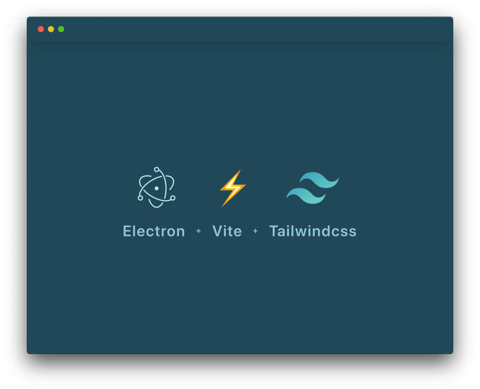

# Electron 11 + Vite 2 + Tailwind 2 - Starter

This Starter utilizes [Electron](https://electronjs.org/), [Vite](https://github.com/vitejs/vite) and [Tailwind](https://tailwindcss.com/) in combination. It trys to adhare the best practices mentioned in the [Talk by Kilian Valkhof](https://www.youtube.com/watch?v=fw4PmPaghyU)

## Installation

`yarn`

## Development

`yarn dev`

## Build

`yarn build`
